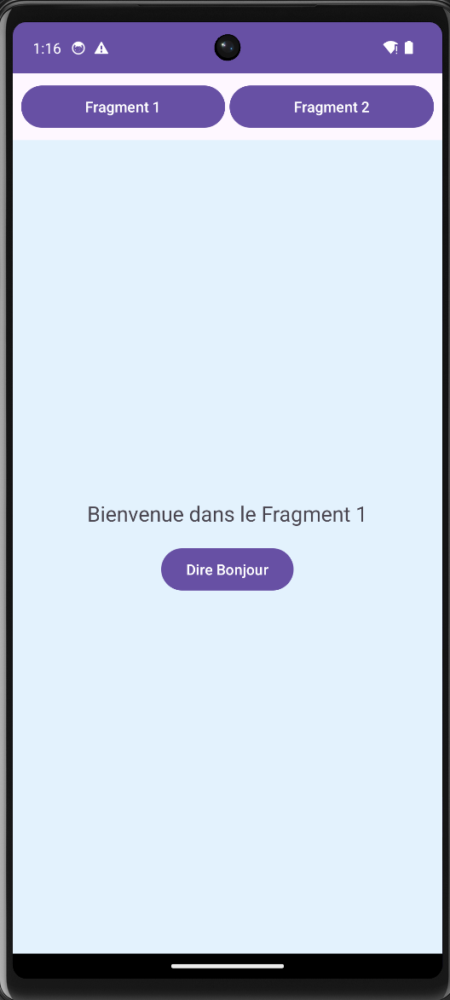
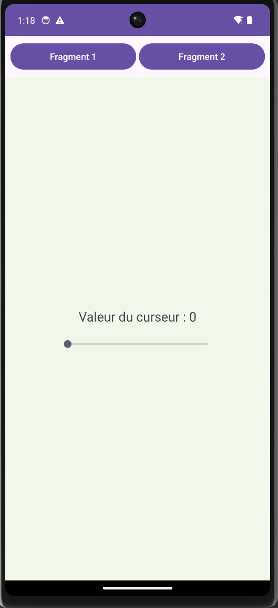

# LAB 4 - Ma premiere application avec des Fragments
**Cours :** Programmation Mobile : Android avec Java  

## Resultat Final (Screenshots)
Voici comment l'application se comporte quand on passe d'un fragment a l'autre :

| Fragment 1 (Accueil) | Fragment 2 (Interactif) |
| :---: | :---: |
|  |  |
| On voit le bouton pour dire bonjour | On peut bouger la barre (SeekBar) |

---

## Demonstration Video
J'ai enregistre une petite video pour montrer que le passage entre les deux se fait sans bug et que le bouton "Retour" du telephone fonctionne bien grace au `BackStack`.

[<video src="video.mp4" controls="controls" style="max-width: 100%;">
</video>](https://github.com/user-attachments/assets/9061e72d-aaf1-4afe-8534-30c49bc7fbb7)

---

## Les etapes de mon travail

### 1. Le conteneur (activity_main.xml)
J'ai cree un layout avec deux boutons en haut et surtout un `FrameLayout` en bas. C'est comme une boite vide ou je vais "injecter" mes fragments.

### 2. La gestion du changement (MainActivity.java)
C'est la partie la plus importante. J'utilise le `FragmentManager`. 
- **L'astuce :** Utiliser `replace()` au lieu de `add()` pour ne pas empiler les morceaux les uns sur les autres.
- **Le truc indispensable :** `addToBackStack(null)` pour que, si j'appuie sur le bouton retour, je revienne au fragment d'avant au lieu de fermer l'appli.

### 3. Les Fragments (Java & XML)
Chaque fragment a son propre petit fichier XML et sa classe Java. 
- Dans le **Fragment 1**, j'ai mis un bouton simple.
- Dans le **Fragment 2**, j'ai teste une `SeekBar`. J'ai du faire attention a bien utiliser `onViewCreated` pour trouver mes IDs, car dans un fragment, on ne peut pas le faire directement dans le `onCreate`.

---

## Resume des notions cles
*   **FragmentManager** : Le cerveau qui decide quel fragment afficher.
*   **FragmentTransaction** : C'est comme une commande qu'on envoie au cerveau (beginTransaction, replace, commit).
*   **Cycle de vie** : C'est un peu plus complexe qu'une Activity car le fragment est "attache" a son parent.

---

